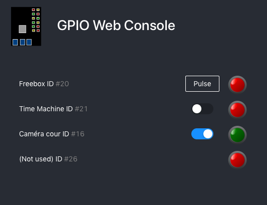

[](https://sonarcloud.io/dashboard?id=hirle_gpio-web-console)[](https://sonarcloud.io/dashboard?id=hirle_gpio-web-console)


# GPIO web console

Ease the control gpio pins through a web application



## Installation

A ansible playbook is available, see the directory ansible. This is will download the latest release from GitHub and make it run as a service. To proceed:

- adapt the `inventory/hosts` file
- adapt the `installs/files/config.json` file
- run `ansible-playbook installs/mail-in-memory.yml`

## Running

### Prepare a config file

This file named `config.json` must look like
```javascript
{
    "port": 3040,
    "gpio": [
      {
        "pin": 21,
        "id": "freebox",
        "name": "Freebox",
        "mode": "PULSE"
      },
      {
        "pin": 20,
        "id": "tm",
        "name": "Time Machine",
        "mode": "TWOSTATES"
      },
      {
        "pin": 26,
         "id": "cour",
        "name": "Caméra cour",
        "mode": "TWOSTATES"
      },
      {
        "pin": 16,
         "id": "notused",
        "name": "(Not used)",
        "mode": "NOTWIRED"
      }
    ]
  }
```

### Run

`npm install`
`npm start -- (path to)/config.json`

## API

### Get all states

Request:

`GET /api/gpio`

Response:
```javascript
[
		{
      "pin": 21,
      "id": "freebox",
      "name": "Freebox",
      "state": true,
      "mode": "PULSE"
  	},
    {
      "pin": 20,
      "id": "tm",
      "name": "Time Machine",
      "state": false,
      "mode": "TWOSTATES"
    },
  	{
      "pin": 26,
      "id": "notwired",
      "name": "(not used)",
      "state": false,
      "mode": "NOTWIRED"
  	}
]
```


### Change state

Request:
`PUT /api/gpio?id=freebox&state=true`


### Pulse

Will switch during 1 second, then switch back off

Request:
`PUT /api/gpio/freebox/pulse`
